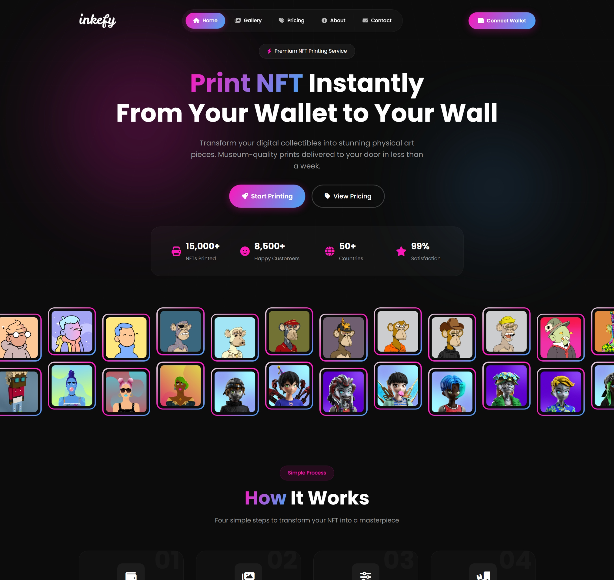

# Inkefy - Premium NFT Printing Service

Inkefy is a modern, high-performance Angular application designed to bridge the gap between digital art (NFTs) and physical displays. It offers a seamless experience for users to print their NFTs on premium materials like canvas, metal, and acrylic.

## Live Demo
Check out the live version here: [gp-inkefy.netlify.app](https://gp-inkefy.netlify.app)

## Key Features

### 🎨 Premium UI/UX
- **Modern Design**: Glassmorphism effects, gradient text, and dark mode aesthetics.
- **Responsive Layout**: Fully optimized for mobile, tablet, and desktop devices.
- **Smooth Animations**: 
  - **Route Transitions**: Elegant fade-in and slide-up animations when navigating between pages.
  - **Scroll Animations**: Sections gracefully slide into view as you scroll down.

### 🚀 Core Functionality
- **Home Page**: Engaging hero section and feature highlights.
- **Gallery**: Browse and filter NFT collections with dynamic sorting and categorization.
- **Pricing**: Detailed pricing plans with toggle for monthly/annual billing.
- **Contact**: Interactive contact form and FAQ section.
- **About**: Company story, values, and team showcase.

## Tech Stack
- **Framework**: Angular 15+
- **Styling**: SCSS with custom variables and mixins
- **Icons**: FontAwesome 6
- **Animations**: Angular Animations & Intersection Observer API

## Development

Run `ng serve` for a dev server. Navigate to `http://localhost:4200/`. The application will automatically reload if you change any of the source files.

## Build

Run `ng build` to build the project. The build artifacts will be stored in the `dist/` directory.
